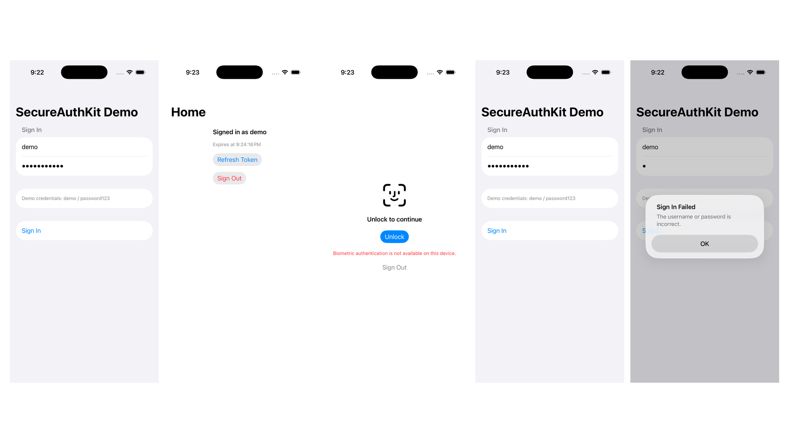

# SecureAuthKit



An example iOS authentication SDK demonstrating biometric authentication and
secure token storage, plus a SwiftUI demo app exercising the full flow.

## What's included

- **`SecureAuthKit`** (Swift Package, `Sources/SecureAuthKit`) — the SDK:
  - `BiometricAuthenticator` — Face ID / Touch ID via `LocalAuthentication`
  - `SecureTokenStore` — Keychain-backed token storage via `Security`
  - `MockAuthProvider` — simulates a login/token-refresh backend (no network)
  - `AuthSession` — the public facade composing the three above
- **`SecureAuthKitDemo`** (SwiftUI app, generated with [XcodeGen](https://github.com/yonaskolb/XcodeGen)) —
  consumes `SecureAuthKit` as a local package dependency and demonstrates
  login → biometric unlock on relaunch → token refresh → sign out.

## What's intentionally out of scope

- Real network/backend integration (see `MockAuthProvider`)
- OAuth2/OIDC social login
- App Attest / DeviceCheck device integrity verification

## Security Model & Trade-offs

The stored `AuthToken` is written to the Keychain with accessibility
`kSecAttrAccessibleWhenUnlockedThisDeviceOnly`, but it is **not** bound to
biometry — the item carries no `SecAccessControl` / `kSecAttrAccessControl`.
`BiometricAuthenticator` is therefore an app-level UI gate in front of data the
Keychain will hand back to this app whenever the device is unlocked, not a gate
the Keychain itself enforces. Anything that can run as this app (a debugger
attached to a development build, for instance) can read the token without ever
passing Face ID. A production SDK would create the item with
`SecAccessControlCreateWithFlags(nil, kSecAttrAccessibleWhenUnlockedThisDeviceOnly, .biometryCurrentSet, &error)`
so the Keychain requires a fresh biometric match on every read and invalidates
the item if the enrolled biometric set changes. That is deliberately omitted
here to keep the example focused on SDK composition and testability.

See `docs/superpowers/specs/2026-09-12-secureauthkit-design.md` for the full
design rationale.

## Building and testing the SDK

```bash
swift test
```

Runs on macOS directly (no simulator needed) since the package also declares
macOS 13 as a supported platform for fast local testing.

## Running the demo app

```bash
cd SecureAuthKitDemo
xcodegen generate   # only needed after adding/removing source files
open SecureAuthKitDemo.xcodeproj
```

Build and run on an iOS Simulator with **Features → Face ID → Enrolled**
turned on so the biometric prompts work. Demo credentials: `demo` / `password123`.

## Screenshots

See [docs/screenshots/README.md](docs/screenshots/README.md) for what each
screen demonstrates and step-by-step instructions to trigger the Face ID
and token-expiry scenarios yourself.
