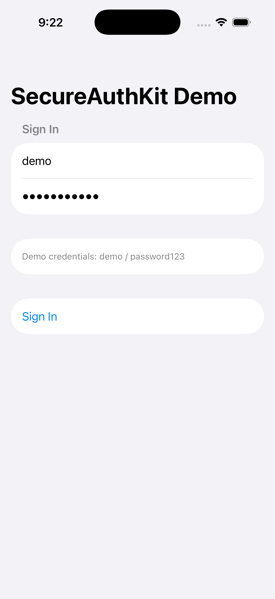
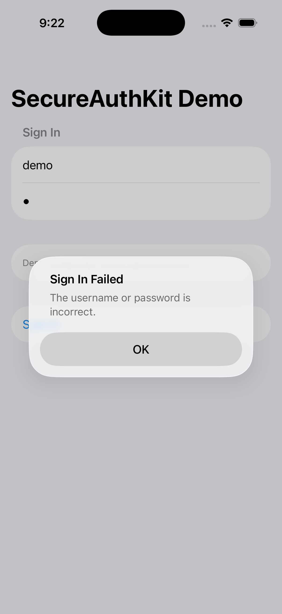
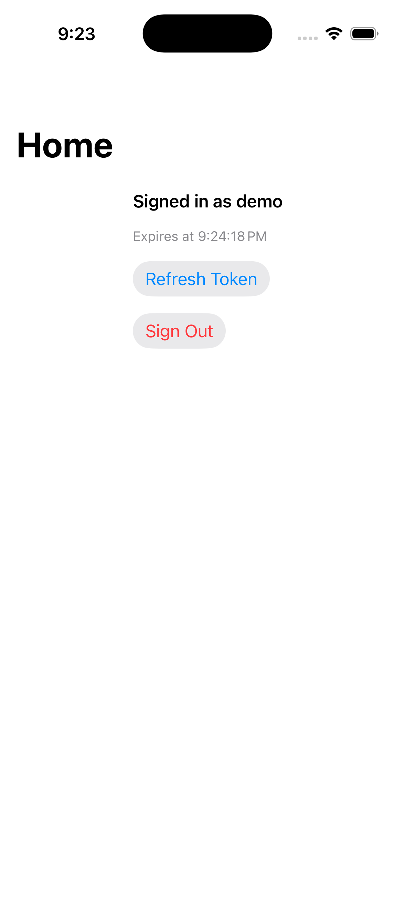
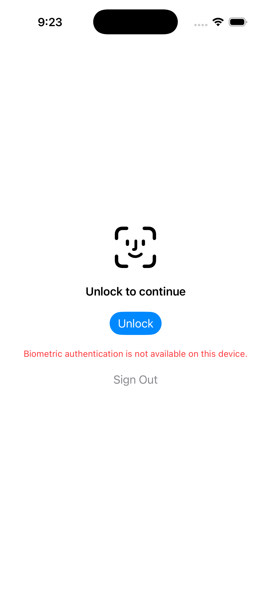

# SecureAuthKit Demo — Screenshot Walkthrough

Screenshots taken on the iOS Simulator (iPhone 17, iOS 26.2), captured with
`xcrun simctl io <device> screenshot`. This page shows every behavior the
demo implements and exactly how to reproduce each one yourself.

## Setup

```bash
cd SecureAuthKitDemo
xcodegen generate
open SecureAuthKitDemo.xcodeproj
```

Pick an iPhone simulator in Xcode's device selector and hit **Run** (`⌘R`).
Demo credentials are pre-filled on the login screen: `demo` / `password123`.

---

## 1. Login screen



First launch, no saved session — `AuthState.loggedOut`. Fields are
pre-filled with the mock credentials.

**To reproduce:** fresh install, or tap **Sign Out** from anywhere.

---

## 2. Wrong credentials



Typing anything other than `demo` / `password123` and tapping **Sign In**
throws `AuthError.invalidCredentials`, surfaced as an alert.

**To reproduce:** change either field to a wrong value, tap **Sign In**.

---

## 3. Successful login



Correct credentials → `MockAuthProvider.login` succeeds (after a simulated
~0.5s network delay) → token saved to Keychain → `HomeView`.

**To reproduce:** leave the pre-filled `demo` / `password123`, tap
**Sign In**.

---

## 4. Biometric lock screen (relaunch)



Force-quitting and relaunching the app with a saved token shows
`BiometricLockView` instead of the login form — the session was never
signed out, it just needs to be unlocked. On a simulator with no Face ID
enrolled, `canAuthenticate()` returns `false` and the screen shows a
graceful error instead of attempting a prompt. The **Sign Out** button
underneath is the escape hatch added during the final code review — without
it, a device that can no longer authenticate (unenrolled, passcode
removed, lockout) would be permanently stuck here.

**To reproduce:** sign in, then stop and relaunch the app (⌘R in Xcode, or
swipe it away in the simulator and reopen).

---

## 5. Sign out


Tapping **Sign Out** (from either `HomeView` or the biometric lock screen)
clears the Keychain entry and returns to the login screen.

**To reproduce:** tap **Sign Out**.

---

## Scenarios that need Face ID enrolled (not captured here)

These require toggling **Simulator → Features → Face ID → Enrolled**, a
macOS menu-bar action that can't be scripted headlessly — you'll need to do
this by hand in the Simulator app itself.

1. Boot the simulator, open the **Simulator** app window.
2. Menu bar: **Features → Face ID → Enrolled** (check it).
3. Sign in to the demo app, then relaunch it. `BiometricLockView` appears
   and automatically triggers a Face ID prompt.
4. **Features → Face ID → Matching Face** — the prompt succeeds, the app
   unlocks straight to `HomeView` with no server call
   (`AuthSession.unlockWithBiometrics`).
5. Repeat from step 3, but choose **Features → Face ID → Non-matching
   Face** instead — `AuthError.biometryFailed` is thrown and shown on the
   lock screen; **Unlock** to retry or **Sign Out** to bail out.
6. To see the post-relaunch **token refresh** fix: sign in, wait 60+
   seconds (the mock token's lifetime), then relaunch and pass Face ID.
   `unlockWithBiometrics` detects the stored token is expired, calls
   `MockAuthProvider.refresh` automatically, and lands on `HomeView` with a
   *new* expiry time rather than the stale one.

On a real device, Face ID is already enrolled from your normal phone setup,
so steps 3-6 work exactly like this without any simulator menu tricks.

## Two more you can trigger without Face ID

- **Manual refresh before expiry:** on `HomeView`, tap **Refresh Token**
  before 60 seconds have passed — the expiry time stays the same, since
  `refreshTokenIfNeeded()` only calls the provider when the token is
  actually expired.
- **Manual refresh after expiry:** same button, after waiting 60+ seconds
  — the expiry time advances to a new timestamp.
